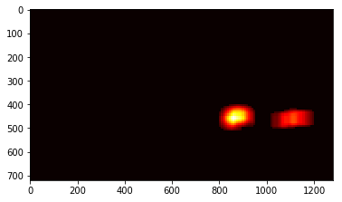
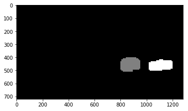
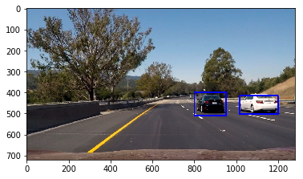
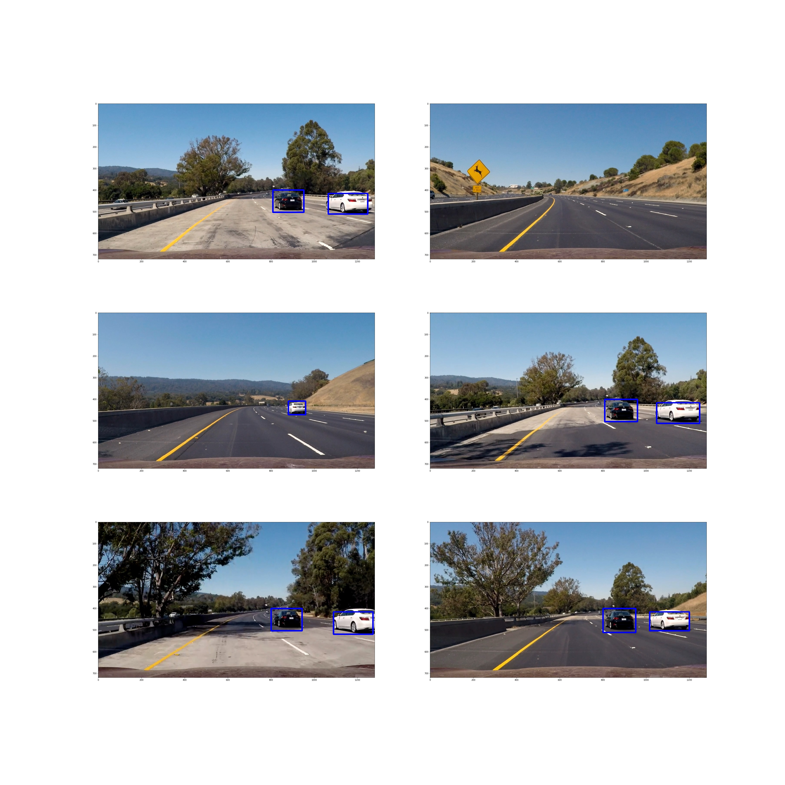

## Vehicle Detection Project

### Rubric Points
 Here I will consider the [rubric points](https://review.udacity.com/#!/rubrics/513/view) individually and describe how I addressed each point in my implementation. 
### Introduction
The goals / steps of this project are the following:

* Load image dataset.
* Optionally, using `cv2.flip` to enhance the number of images. 
* Split dataset to train/test set, and move test images to `testdata` directory .
* Using `keras.preprocessing.image.ImageDataGenerator` load training&testing dataset.
* Building a deep neural network model.
* Training、Evaluating and saving model.
* Building pipline.
* Run your pipeline on a video stream (start with the test_video.mp4 and later implement on full project_video.mp4) and create a heat map of recurring detections frame by frame to reject outliers and follow detected vehicles.
* Estimate a bounding box for vehicles detected.

---
### Data Set Summary & Exploration

##### Provide a basic summary of the data set. In the code, the analysis should be done using python, numpy and/or pandas methods rather than hardcoding results manually.

##### Step 1: Load image dataset
I started by reading in all the `vehicle` and `non-vehicle` images. 
```
cars_path = './data/vehicles'
not_cars_path = './data/non-vehicles'

cars = glob.glob(cars_path+'/*/*.png')
not_cars = glob.glob(not_cars_path+'/*/*.png')
```
##### Step 2: Explore Data

The size of car samples is `8792`  
The size of not car samples is `8968`   

##### Step 3: Augment Data
```
import cv2
import os
for car_path in cars:
    img = cv2.imread(car_path)
    save_path, file_name = os.path.split(car_path)
    h_flip = cv2.flip(img, 1)
    cv2.imwrite(os.path.join(save_path,'h_flip_'+file_name), h_flip)
    
for not_car_path in not_cars:
    img = cv2.imread(not_car_path)
    save_path, file_name = os.path.split(not_car_path)
    h_flip = cv2.flip(img, 1)
    cv2.imwrite(os.path.join(save_path,'h_flip_'+file_name), h_flip)
```
Expanding the amount of image data by horizontal flipping image, in order to improve the performance of the deep neural network model.

##### Step 4: Split Data
Extract some data from the dataset as test data and save it in the `testdata` directory.
The data set structure is as follows.
```
.
├── data
│   ├── vehicles
│   └── non-vehicles
└── testdata
    ├── non-vehicles
    └── vehicles
```
##### Step 5: Visualizing data

<div  align="center">    

</div>

---
### Deep Neural Network Architecture

##### Step 1: Building CNN model

How to build model, you can see the code section of load model in the `train_keras_model.ipynb`. Model architecture is as follows:
```

_________________________________________________________________
Layer (type)                 Output Shape              Param #   
=================================================================
lambda_1 (Lambda)            (None, 64, 64, 3)         0         
_________________________________________________________________
conv2d_1 (Conv2D)            (None, 64, 64, 64)        4864      
_________________________________________________________________
max_pooling2d_1 (MaxPooling2 (None, 32, 32, 64)        0         
_________________________________________________________________
conv2d_2 (Conv2D)            (None, 32, 32, 128)       73856     
_________________________________________________________________
max_pooling2d_2 (MaxPooling2 (None, 16, 16, 128)       0         
_________________________________________________________________
batch_normalization_1 (Batch (None, 16, 16, 128)       512       
_________________________________________________________________
dropout_1 (Dropout)          (None, 16, 16, 128)       0         
_________________________________________________________________
conv2d_3 (Conv2D)            (None, 16, 16, 128)       147584    
_________________________________________________________________
max_pooling2d_3 (MaxPooling2 (None, 8, 8, 128)         0         
_________________________________________________________________
batch_normalization_2 (Batch (None, 8, 8, 128)         512       
_________________________________________________________________
dropout_2 (Dropout)          (None, 8, 8, 128)         0         
_________________________________________________________________
conv2d_4 (Conv2D)            (None, 1, 1, 64)          524352    
_________________________________________________________________
dropout_3 (Dropout)          (None, 1, 1, 64)          0         
_________________________________________________________________
conv2d_5 (Conv2D)            (None, 1, 1, 2)           130       
_________________________________________________________________
activation_1 (Activation)    (None, 1, 1, 2)           0         
_________________________________________________________________
reshape_1 (Reshape)          (None, 2)                 0         
=================================================================
Total params: 751,810
Trainable params: 751,298
Non-trainable params: 512
_________________________________________________________________
```
##### Note:
The output shape which the last two layers of the model are `(None,1,1,2)` and `(None,2)`. `None` is `batch size`, `2` is `num_classes`. So your model last two layer output shape are must `(None, 1,1,num_classes)` and `(None,num_classes)`.

##### Step 2: Load Train&Test data
Use Keras ImageDataGenerator to load Train&Test data.
```
from keras.preprocessing.image import ImageDataGenerator
batch_size = 64
train_datagen = ImageDataGenerator(
        shear_range=0.2,
        zoom_range=0.1,
        rotation_range=10.,
        horizontal_flip=True)

train_generator = train_datagen.flow_from_directory(
        'data',
        target_size=(64, 64),
        batch_size=batch_size)

test_datagen = ImageDataGenerator()
test_generator = test_datagen.flow_from_directory(
        'testdata',
        target_size=(64, 64),
        batch_size=batch_size)
```
About the detail of keras ImageDataGenerator you can see [here](https://keras-cn.readthedocs.io/en/latest/preprocessing/image/)

Here explain the `flow_from_directory` usage. `data` and `testdata` are the directory which you want to load the data set of `Train` and `Test`.
`target_size=(64, 64)` is image shape. `batch_size=batch_size` setting CNN model batch size.

##### Step 3: Train and Save CNN Model

```
history_object = model.fit_generator(
        train_generator,
        steps_per_epoch= 33743  // batch_size,
        epochs= 10,
        callbacks=callbacks,
        validation_data = test_generator,
        validation_steps = 1777  // batch_size)
model.save('./model/model.h5')
print("Model Saved!")
```
##### Step 4: Visualize training model result
Visualization code is as follows:
```
from matplotlib import pyplot as plt
history=history
plt.plot(history.history['acc'])
plt.plot(history.history['val_acc'])
plt.title('model accuracy')
plt.xlim(0,10)
plt.ylabel('accuracy')
plt.xlabel('epoch')
plt.legend(['train', 'test'], loc='upper left')
plt.savefig('output_images/acc.png')
plt.show()
# summarize history for loss
plt.plot(history.history['loss'])
plt.plot(history.history['val_loss'])
plt.title('model loss')
plt.xlim(0, 10)
plt.ylim(0, 0.5)
plt.ylabel('loss')
plt.xlabel('epoch')
plt.legend(['train', 'test'], loc='upper left')
plt.savefig('out')
plt.show()
```
<div  align="center">    


</div>

##### Summary:
The accuracy of the training set and the test set are very similar, indicating that the model is not over-fitting.

##### Step 5: Test model 
- Load model
```
model = CNN_model(input_shape = (260, 1280, 3), is_training = False)
model.load_weights('./model/model.h5')
```
**Remark**
The `is_training` parameter of `CNN_model` must be setted `False` when you used model to prediction.

- Generating heat map image
```
imgimg  ==  mpimgmpimg..imreadimread(('./test_images/test6.jpg''./test_ )
heatmap = gen_heatmap(img, 1)
bboxs =  get_bboxes(heatmap)
heat = np.zeros(img.shape[0:2], dtype = np.float)
heat = add_heat(heat, bboxs)
plt.imshow(heat, cmap='hot')
plt.show()
heat = apply_threshold(heat, 3)
```
Function `gen_heatmap(img, class_index)`.  
Parameters: `img`: The image you need to detect. `class_index`: `int` Detected category, 0:`non-vehicle`, 1:`vehicle`.
The generated heat map is as follows:
<div  align="center">    

</div>

- Generating label image
```
from scipy.ndimage.measurements import label
labels = label(heat)
print(labels[1], 'cars found')
plt.imshow(labels[0], cmap='gray')
plt.show()
```
<div  align="center">    

</div>

- Draw bounding boxes on a image
```
draw_img = draw_labeled_bboxes(np.copy(img), labels)
plt.imshow(draw_img)
plt.show()
```
<div  align="center">    

</div>

- Test all images
The result is as follows:

<div  align="center">    

</div>

### Pipline Code
Combine the **Step 5: Test model** contents of the previous chapter to form a pipline function.
```
def pipline(img):
    global model
    img_crop = img[400:660,:,:]
    img_crop = imresize(img_crop,(260, 1280))
    img_crop = np.expand_dims(img_crop, axis = 0)
    heatmap = model.predict(img_crop)
    heatmap[ heatmap < 0.99 ] = 0
    heatmap[ heatmap >= 0.99] = 1
    heatmap2 = np.squeeze(heatmap)[:, :, 1]    
    bboxes = get_bboxes(heatmap2)
    
    heat = np.zeros(img.shape[0:2], dtype = np.float)
    heat = add_heat(heat, bboxes)
    heat = apply_threshold(heat, 3)

    # Visualize the heatmap when displaying    
    #heatmap = np.clip(heat, 0, 255)
    labels = label(heat)

    draw_img = draw_labeled_bboxes(np.copy(img), labels)
    return draw_img
```

### Video Implementation
An example of applying the pipeline to a video can be found [here](./project_video_output.mp4)


### Discussion

##### Briefly discuss any problems / issues you faced in your implementation of this project.  Where will your pipeline likely fail?  What could you do to make it more robust?

- At the beginning, the model's bias is very large. In order to overcome this problem, use the image flipping technique to expand the data.
- Sometimes there are repeated boxes on the same car. I think it would be better to use IOU and NMS. I might improve it if I were going to pursue this project further.  

