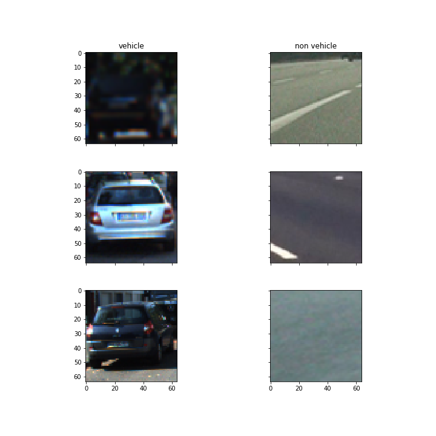
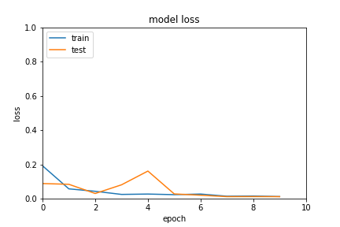
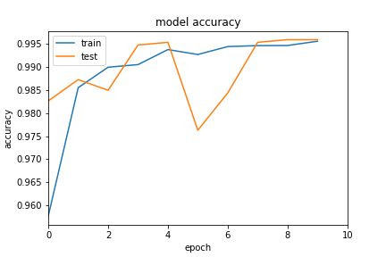

## Vehicle Detection Project

### Rubric Points
 Here I will consider the [rubric points](https://review.udacity.com/#!/rubrics/513/view) individually and describe how I addressed each point in my implementation. 
### Introduction
The goals / steps of this project are the following:

* Load image dataset.
* Optionally, using `cv2.flip` to enhance the number of images. 
* Split dataset to train/test set, and move test images to `testdata` directory .
* Using `keras.preprocessing.image.ImageDataGenerator` load training&testing dataset.
* Building a deep neural network model.
* Training、Evaluating and saving model.
* Building pipline.
* Run your pipeline on a video stream (start with the test_video.mp4 and later implement on full project_video.mp4) and create a heat map of recurring detections frame by frame to reject outliers and follow detected vehicles.
* Estimate a bounding box for vehicles detected.

---
### Data Set Summary & Exploration

##### Provide a basic summary of the data set. In the code, the analysis should be done using python, numpy and/or pandas methods rather than hardcoding results manually.

##### Step 1: Load image dataset
```
cars_path = './data/vehicles'
not_cars_path = './data/non-vehicles'

cars = glob.glob(cars_path+'/*/*.png')
not_cars = glob.glob(not_cars_path+'/*/*.png')
```
##### Step 2: Explore Data

The size of car samples is `8792`  
The size of not car samples is `8968`   

##### Step 3: Augment Data
```
import cv2
import os
for car_path in cars:
    img = cv2.imread(car_path)
    save_path, file_name = os.path.split(car_path)
    h_flip = cv2.flip(img, 1)
    cv2.imwrite(os.path.join(save_path,'h_flip_'+file_name), h_flip)
    
for not_car_path in not_cars:
    img = cv2.imread(not_car_path)
    save_path, file_name = os.path.split(not_car_path)
    h_flip = cv2.flip(img, 1)
    cv2.imwrite(os.path.join(save_path,'h_flip_'+file_name), h_flip)
```
Expanding the amount of image data by horizontal flipping image, in order to improve the performance of the deep neural network model.

##### Step 4: Split Data
Extract some data from the dataset as test data and save it in the `testdata` directory.
The data set structure is as follows.
```
.
├── data
│   ├── vehicles
│   └── non-vehicles
└── testdata
    ├── non-vehicles
    └── vehicles
```
##### Step 5: Visualizing data

<div  align="center">    

</div>

---
### Deep Neural Network Architecture

##### Step 1: Building CNN model

How to build model, you can see the code section of load model in the `train_keras_model.ipynb`. Model architecture is as follows:
```

_________________________________________________________________
Layer (type)                 Output Shape              Param #   
=================================================================
lambda_1 (Lambda)            (None, 64, 64, 3)         0         
_________________________________________________________________
conv2d_1 (Conv2D)            (None, 64, 64, 64)        4864      
_________________________________________________________________
max_pooling2d_1 (MaxPooling2 (None, 32, 32, 64)        0         
_________________________________________________________________
conv2d_2 (Conv2D)            (None, 32, 32, 128)       73856     
_________________________________________________________________
max_pooling2d_2 (MaxPooling2 (None, 16, 16, 128)       0         
_________________________________________________________________
batch_normalization_1 (Batch (None, 16, 16, 128)       512       
_________________________________________________________________
dropout_1 (Dropout)          (None, 16, 16, 128)       0         
_________________________________________________________________
conv2d_3 (Conv2D)            (None, 16, 16, 128)       147584    
_________________________________________________________________
max_pooling2d_3 (MaxPooling2 (None, 8, 8, 128)         0         
_________________________________________________________________
batch_normalization_2 (Batch (None, 8, 8, 128)         512       
_________________________________________________________________
dropout_2 (Dropout)          (None, 8, 8, 128)         0         
_________________________________________________________________
conv2d_4 (Conv2D)            (None, 1, 1, 64)          524352    
_________________________________________________________________
dropout_3 (Dropout)          (None, 1, 1, 64)          0         
_________________________________________________________________
conv2d_5 (Conv2D)            (None, 1, 1, 2)           130       
_________________________________________________________________
activation_1 (Activation)    (None, 1, 1, 2)           0         
_________________________________________________________________
reshape_1 (Reshape)          (None, 2)                 0         
=================================================================
Total params: 751,810
Trainable params: 751,298
Non-trainable params: 512
_________________________________________________________________
```
##### Note:
The output shape which the last two layers of the model are `(None,1,1,2)` and `(None,2)`. `None` is `batch size`, `2` is `num_classes`. So your model last two layer output shape are must `(None, 1,1,num_classes)` and `(None,num_classes)`.

##### Step 2: Load Train&Test data
Use Keras ImageDataGenerator to load Train&Test data.
```
from keras.preprocessing.image import ImageDataGenerator
batch_size = 64
train_datagen = ImageDataGenerator(
        shear_range=0.2,
        zoom_range=0.1,
        rotation_range=10.,
        horizontal_flip=True)

train_generator = train_datagen.flow_from_directory(
        'data',
        target_size=(64, 64),
        batch_size=batch_size)

test_datagen = ImageDataGenerator()
test_generator = test_datagen.flow_from_directory(
        'testdata',
        target_size=(64, 64),
        batch_size=batch_size)
```
About the detail of keras ImageDataGenerator you can see [here](https://keras-cn.readthedocs.io/en/latest/preprocessing/image/)

Here explain the `flow_from_directory` usage. `data` and `testdata` are the directory which you want to load the data set of `Train` and `Test`.
`target_size=(64, 64)` is image shape. `batch_size=batch_size` setting CNN model batch size.

##### Step 3: Train and Save CNN Model

```
history_object = model.fit_generator(
        train_generator,
        steps_per_epoch= 33743  // batch_size,
        epochs= 10,
        callbacks=callbacks,
        validation_data = test_generator,
        validation_steps = 1777  // batch_size)
model.save('./model/model.h5')
print("Model Saved!")
```
##### Step 4: Visualize training model result
Visualization code is as follows:
```
from matplotlib import pyplot as plt
history=history
plt.plot(history.history['acc'])
plt.plot(history.history['val_acc'])
plt.title('model accuracy')
plt.xlim(0,10)
plt.ylabel('accuracy')
plt.xlabel('epoch')
plt.legend(['train', 'test'], loc='upper left')
plt.savefig('output_images/acc.png')
plt.show()
# summarize history for loss
plt.plot(history.history['loss'])
plt.plot(history.history['val_loss'])
plt.title('model loss')
plt.xlim(0, 10)
plt.ylim(0, 0.5)
plt.ylabel('loss')
plt.xlabel('epoch')
plt.legend(['train', 'test'], loc='upper left')
plt.savefig('out')
plt.show()
```

Figure 1. Loss result

Figure 2. Accuracy result


I started by reading in all the `vehicle` and `non-vehicle` images.  Here is an example of one of each of the `vehicle` and `non-vehicle` classes:

![alt text][image1]

I then explored different color spaces and different `skimage.hog()` parameters (`orientations`, `pixels_per_cell`, and `cells_per_block`).  I grabbed random images from each of the two classes and displayed them to get a feel for what the `skimage.hog()` output looks like.

Here is an example using the `YCrCb` color space and HOG parameters of `orientations=8`, `pixels_per_cell=(8, 8)` and `cells_per_block=(2, 2)`:


![alt text][image2]

#### 2. Explain how you settled on your final choice of HOG parameters.

I tried various combinations of parameters and...

#### 3. Describe how (and identify where in your code) you trained a classifier using your selected HOG features (and color features if you used them).

I trained a linear SVM using...

### Sliding Window Search

#### 1. Describe how (and identify where in your code) you implemented a sliding window search.  How did you decide what scales to search and how much to overlap windows?

I decided to search random window positions at random scales all over the image and came up with this (ok just kidding I didn't actually ;):

![alt text][image3]

#### 2. Show some examples of test images to demonstrate how your pipeline is working.  What did you do to optimize the performance of your classifier?

Ultimately I searched on two scales using YCrCb 3-channel HOG features plus spatially binned color and histograms of color in the feature vector, which provided a nice result.  Here are some example images:

![alt text][image4]
---

### Video Implementation

#### 1. Provide a link to your final video output.  Your pipeline should perform reasonably well on the entire project video (somewhat wobbly or unstable bounding boxes are ok as long as you are identifying the vehicles most of the time with minimal false positives.)
Here's a [link to my video result](./project_video.mp4)


#### 2. Describe how (and identify where in your code) you implemented some kind of filter for false positives and some method for combining overlapping bounding boxes.

I recorded the positions of positive detections in each frame of the video.  From the positive detections I created a heatmap and then thresholded that map to identify vehicle positions.  I then used `scipy.ndimage.measurements.label()` to identify individual blobs in the heatmap.  I then assumed each blob corresponded to a vehicle.  I constructed bounding boxes to cover the area of each blob detected.  

Here's an example result showing the heatmap from a series of frames of video, the result of `scipy.ndimage.measurements.label()` and the bounding boxes then overlaid on the last frame of video:

### Here are six frames and their corresponding heatmaps:

![alt text][image5]

### Here is the output of `scipy.ndimage.measurements.label()` on the integrated heatmap from all six frames:
![alt text][image6]

### Here the resulting bounding boxes are drawn onto the last frame in the series:
![alt text][image7]


---

### Discussion

#### 1. Briefly discuss any problems / issues you faced in your implementation of this project.  Where will your pipeline likely fail?  What could you do to make it more robust?

Here I'll talk about the approach I took, what techniques I used, what worked and why, where the pipeline might fail and how I might improve it if I were going to pursue this project further.  

